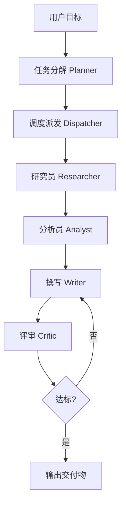

# 多智能体协作系统 · 深度研究报告生成器

> 基于 **LangGraph** 自研轻量多智能体编排框架，调度 4 类角色（研究员 / 分析员 / 撰写员 / 评审员），
> 通过 **Critic 质量门** 实现自动迭代闭环，输入一个主题，产出一份**带引用的深度研究报告（Markdown）**。

设计报告见 [`ARCHITECTURE.md`](./ARCHITECTURE.md)（与 `设计报告.md` 一一对应）。

---

## ✨ 特性

- **编排级工程能力**：LangGraph 状态机（节点 + 条件边）实现「分解 → 调度 → 角色 → 质量门 → 回流」。
- **职责单一的角色**：每个 Agent 是独立 LLM 上下文，通过共享黑板（Blackboard）交换产物，互不污染 prompt。
- **质量门迭代闭环**：Critic 按 rubric 打分，不达标带 feedback 回流 Writer；`max_iteration` 强制上限，防死循环。
- **可观测 / 可度量**：每次调用记录 token 成本、节点耗时、迭代轮数，支持回归评测。
- **多模型可切换**：统一 Model Adapter，内置 OpenAI / 通义千问 / 混元；默认 `mock` 离线即可跑通。
- **零依赖可运行**：内置轻量向量库（TF 向量 + 余弦相似度），无需联网安装 chromadb。

---

## 🚀 快速开始

### 1. 准备环境

```bash
# 使用任意 Python 3.10+ 虚拟环境
python -m venv .venv
source .venv/bin/activate        # Windows: .venv\Scripts\activate
pip install -r requirements.txt
```

### 2. 一键出报告（无需任何 API Key）

```bash
python main.py "对比 LangGraph 与 AutoGen 的优缺点"
# 或：python -m src.main "你的主题"
```

默认 `provider=mock`，整条流水线离线跑通，报告写入 `outputs/`。

### 3. 接入真实模型

```bash
cp .env.example .env
# 编辑 .env，填入 OPENAI_API_KEY / QWEN_API_KEY / HUNYUAN_SECRET_ID 等
# 并把 config.yaml 的 model.provider 改为 openai / qwen / hunyuan
python main.py "你的主题" --provider qwen
```

常用参数：

| 参数 | 说明 |
|------|------|
| `goal` | 报告主题（位置参数） |
| `--goal-file` | 从文件读取主题 |
| `--provider` | 覆盖模型供应商：`mock/openai/qwen/hunyuan` |
| `--max-iteration` | 覆盖质量门最大迭代次数（默认 3） |
| `--output` | 指定输出 Markdown 路径 |
| `--config` | 指定配置文件（默认 `config.yaml`） |

---

## 🧱 架构

```
接入层 Interface    CLI / API：收目标、返回交付物
编排层 Orchestration LangGraph 状态机（planner/dispatcher/researcher/analyst/writer/critic + quality_gate）
角色层 Agents        研究员 │ 分析员 │ 撰写员 │ 评审员（独立 LLM 上下文）
工具层 Tools        统一 Tool 接口：WebSearch / RAGRetriever
记忆层 Memory       共享黑板 Blackboard + 轻量向量库 VectorStore
模型适配层 Model    统一 LLM 接口，多模型可切换 + token 计量
可观测/评测层        tracer（耗时/调用）· cost（token/成本）· eval 评测集
```

运行时主链路（mermaid）：



> Dispatcher 对 Planner 产出的子任务 DAG 做拓扑排序；当前参考实现按拓扑顺序执行
> （研究员 → 分析员 存在依赖），保证正确性。架构本身支持无依赖子任务并行。

---

## 📁 目录结构

```
multi_agent_report/
├── main.py / src/main.py     # CLI 入口
├── config.yaml / .env.example
├── requirements.txt
├── src/
│   ├── config.py             # 配置加载
│   ├── graph/                # state.py / builder.py（LangGraph 编排 + 质量门）
│   ├── agents/               # base / researcher / analyst / writer / critic
│   ├── tools/                # base / web_search / rag
│   ├── memory/               # blackboard / vector_store
│   ├── models/               # adapter + providers(mock/openai/qwen/hunyuan)
│   └── observability/        # tracer / cost
├── eval/                     # cases.json / run_eval.py
├── tests/                    # test_pipeline.py
└── outputs/                  # 生成的报告与中间产物（git 忽略）
```

---

## 📊 评测

```bash
pytest -q                 # 流水线单测（端到端 / 质量门迭代 / 引用防泄漏 / 向量库）
python eval/run_eval.py   # 遍历 eval/cases.json，输出通过率/成本/耗时报表
```

指标：一次通过率、最终达标率、平均 Critic 分、单篇平均成本、平均 token、平均迭代轮数、平均耗时。
每次改动 Prompt / 逻辑后跑 `run_eval.py` 对比指标，防止退化。

---

## 🛡️ 防死循环与防幻觉

- **防死循环**：质量门设 `max_iteration`（默认 3），达到上限强制输出当前最优草稿并标记「未完全达标」。
- **防引用幻觉**：Writer 禁止无引用断言；Researcher 过滤掉无 URL 的伪引用；Critic 校验引用真实性与单项 0 分。

---

## 💼 简历呈现（建议）

> 基于 LangGraph 自研轻量多智能体编排框架，设计 Orchestrator 调度 4 类角色（研究/分析/撰写/评审），
> 通过 Critic 质量门实现自动迭代闭环；在深度报告生成场景，一次通过率 X%→Y%，单篇平均成本 ¥Z。

面试讲解重点：编排状态机设计、角色协作与上下文隔离、质量门迭代回路、评测闭环如何保证「可衡量好坏」。
