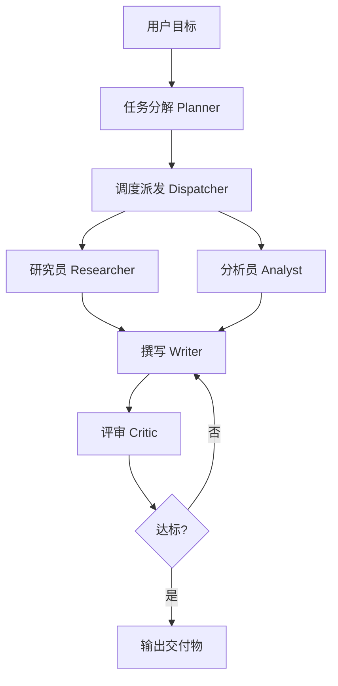

# 多智能体协作系统 · 深度研究报告生成器

> 基于 **LangGraph** 自研轻量多智能体编排框架，调度 4 类角色（研究员 / 分析员 / 撰写员 / 评审员），
> 通过 **Critic 质量门** 实现自动迭代闭环，输入一个主题，产出一份**带引用的深度研究报告（Markdown）**，并支持一键导出 PDF / PPTX 交付物。

设计报告见 [`ARCHITECTURE.md`](./ARCHITECTURE.md)（与 `设计报告.md` 一一对应）。

---

## 📌 它能做什么

- 输入一个**主题**，自动完成「任务分解 → 并行取证/分析 → 撰写 → 评审打分 → 不达标则回流重写」的闭环。
- 产出**带真实引用的深度研究报告**（Markdown），可一键导出 **PDF / PPTX / JSON / MD** 交付物。
- **真联网检索**：可接 DuckDuckGo（零 Key）或 Tavily，报告引用真实来源，而非占位链接。
- **私有文档 RAG**：把你自己的 `.txt / .md / .pdf` 灌入本地向量库，让报告基于你的私有资料生成。
- **零 Key 离线跑通**：默认 `mock` 模式无需任何 API Key，一条命令即可看到完整流水线效果。
- **可度量、可回归**：每次调用记录 token 成本、节点耗时、迭代轮数，配套评测集防止改坏逻辑。

---

## 🧱 整体架构

```
接入层 Interface     CLI(main.py) / Web API(app/server.py)：收目标、返回交付物
编排层 Orchestration LangGraph 状态机（planner/dispatcher/researcher/analyst/writer/critic + quality_gate）
角色层 Agents         研究员 │ 分析员 │ 撰写员 │ 评审员（独立 LLM 上下文，互不污染 prompt）
工具层 Tools         统一 Tool 接口：WebSearch / RAGRetriever / StructuredOutput
记忆层 Memory        共享黑板 Blackboard + 轻量向量库 VectorStore
模型适配层 Model     统一 LLM 接口，多模型可切换 + token 计量
可观测/评测层        tracer（耗时/调用）· cost（token/成本）· eval 评测集
```

运行时主链路（mermaid）：



> **FR-3 并行调度**：Dispatcher 并行扇出到「研究员」与「分析员」两条独立分支（两者互不依赖，
> 分析员仅基于目标/规划产出要点），撰写节点扇入等待两者都完成。运行时并发执行，可显著缩短耗时。

---

## 🛠️ 技术栈

| 类别 | 技术 | 说明 |
|------|------|------|
| 编排框架 | **LangGraph** `>=0.2` | 状态机（节点 + 条件边）实现分解→调度→角色→质量门→回流 |
| 模型适配 | **OpenAI Python SDK 协议**（自研 Adapter） | 统一 `chat/complete` 接口，多供应商可切换；`requests` 直连 `/chat/completions` |
| 网页服务 | **FastAPI** `>=0.110` + **Uvicorn** `>=0.29` | SSE 流式进度推送 + 同步导出接口 |
| 配置 | **Pydantic** `>=2.0` + **PyYAML** + **python-dotenv** `>=1.0` | 配置校验与环境变量覆盖 |
| 真联网检索 | `requests`（DuckDuckGo HTML 解析 / Tavily API） | 零 Key 兜底 + 可选 Tavily |
| 私有文档 RAG | 自研 `VectorStore`（TF 向量 + 余弦相似度）+ **pypdf** `>=4.0` | 内置轻量向量库，免装 chromadb；PDF 解析 |
| 交付物导出 | **ReportLab** `>=4.0`（PDF，STSong-Light CID 中文字体）+ **python-pptx** `>=0.6.23` | 原生中文 PDF / PPTX |
| 测试/评测 | **pytest** `>=7.0` + 自研 `eval/run_eval.py` | 单测 + 回归评测集 |
| 运行时 | Python `>=3.10` | 标准库 + 上述第三方依赖 |

模型供应商支持：

| provider | 接口 | 默认模型 | 鉴权环境变量 | 备注 |
|----------|------|----------|--------------|------|
| `mock` | 内置 | `mock-model` | 无 | 离线可跑通整条流水线，无需 Key |
| `openai` | OpenAI 兼容 | `gpt-4o-mini` | `OPENAI_API_KEY` / `OPENAI_BASE_URL` / `OPENAI_MODEL` | 任意 OpenAI 兼容网关 |
| `deepseek` | OpenAI 兼容 | `deepseek-chat` | `DEEPSEEK_API_KEY` / `DEEPSEEK_BASE_URL` / `DEEPSEEK_MODEL` | 低成本，适合批量评测 |
| `qwen` | OpenAI 兼容（DashScope） | `qwen-plus` | `QWEN_API_KEY` / `QWEN_BASE_URL` / `QWEN_MODEL` | 阿里通义千问 |
| `hunyuan` | 腾讯云 | `hunyuan-pro` | `HUNYUAN_SECRET_ID` / `HUNYUAN_SECRET_KEY` | 需两个密钥，仅走 `.env` |

---

## 🚀 快速开始

### 1. 准备环境

```bash
# 使用任意 Python 3.10+ 虚拟环境
python -m venv .venv
source .venv/bin/activate        # Windows: .venv\Scripts\activate
pip install -r requirements.txt
```

> 如果只用 CLI + mock 模式，核心依赖（langgraph / pydantic / python-dotenv / requests / pytest）即可；
> 要网页界面再装 `fastapi uvicorn`；要 PDF/PPTX 导出再装 `reportlab python-pptx`；要 PDF 摄入再装 `pypdf`。

### 2. 一键出报告（无需任何 API Key）

```bash
python main.py "对比 LangGraph 与 AutoGen 的优缺点"
# 或：python -m src.main "你的主题"
```

默认 `provider=mock`，整条流水线离线跑通，报告写入 `outputs/`。

### 3. 接入真实模型

```bash
cp .env.example .env
# 编辑 .env，填入对应的 API Key（见上方「模型供应商支持」表）
# 并把 config.yaml 的 model.provider 改为 openai / deepseek / qwen / hunyuan
python main.py "你的主题" --provider deepseek
```

也可不改 config，直接命令行覆盖：

```bash
python main.py "你的主题" --provider deepseek
python main.py "你的主题" --provider qwen
python main.py "你的主题" --provider openai
```

> 接真实模型时，若 `.env` 已填 Key，无需额外参数；Key 也可在网页 UI 的「API Key」框临时填入（不落盘）。
> 混元需要 `HUNYUAN_SECRET_ID` + `HUNYUAN_SECRET_KEY` 两个密钥，请写在 `.env` 中。

---

## 📖 CLI 详细操作

### 完整参数

| 参数 | 说明 |
|------|------|
| `goal` | 报告主题（位置参数，必填） |
| `--goal-file` | 从文件读取主题（与位置参数二选一） |
| `--provider` | 覆盖模型供应商：`mock / openai / deepseek / qwen / hunyuan` |
| `--max-iteration` | 覆盖质量门最大迭代次数（默认 3，防死循环） |
| `--output` | 指定输出 Markdown 路径（默认 `outputs/report_<slug>.md`） |
| `--docs-dir` | 私有文档目录（`.txt/.md/.pdf`），用于 RAG 检索增强 |
| `--export` | 导出交付物格式（逗号分隔）：`pdf,pptx,json,md` |
| `--config` | 指定配置文件（默认 `config.yaml`） |

### 示例

```bash
# 基础：mock 离线出报告
python main.py "2025 年大模型推理成本趋势"

# 接 DeepSeek，并指定最多迭代 5 轮
python main.py "RAG 与 Fine-tuning 怎么选" --provider deepseek --max-iteration 5

# 注入私有文档做 RAG（只基于你的资料写报告）
python main.py "我们产品竞品分析" --provider deepseek --docs-dir "D:/my_docs"

# 生成后直接导出 PDF + PPTX 交付物
python main.py "行业研究：低代码平台" --provider qwen --export pdf,pptx

# 从文件读主题
python main.py --goal-file topic.txt --provider deepseek
```

### 输出

运行后在 `outputs/` 下生成：

- `report_<slug>.md` —— 最终报告（带引用）
- `trace.jsonl` —— 每个节点的耗时与调用记录（可观测）
- `cost.json` —— 累计 token 与成本

---

## 🌐 网页应用（FastAPI + 前端）

把流水线包装成带界面的「应用」：浏览器打开、输入主题、点「生成」，实时看到
`Planner → Dispatcher → Researcher / Analyst（并行）→ Writer → Critic` 的执行过程与最终报告。

### 启动

```bash
pip install fastapi uvicorn     # 仅网页模式需要（已写入 requirements.txt）
uvicorn app.server:app --host 127.0.0.1 --port 8000
# 浏览器打开 http://127.0.0.1:8000
```

### 界面操作

- **报告主题**：输入你想研究的主题。
- **模型供应商**：下拉选 `mock / openai / deepseek / qwen / hunyuan`。
- **质量门最大迭代次数**：默认 3，可调 1–10。
- **API Key（可选）**：选 openai / deepseek / qwen 时填入；随请求体发给后端（**不写进 URL**，更安全）；留空则读 `.env`。
- **Base URL（可选）**：自定义兼容网关地址，留空用默认值。
- **文档目录（可选）**：填 `.txt/.md/.pdf` 目录路径，把你的私有资料灌入 RAG。
- **生成报告**：点击后右侧实时渲染报告，左侧实时滚动执行日志与各角色耗时。
- **导出**：报告生成后，点 `PDF / PPTX / JSON / MD` 按钮一键下载交付物。

### HTTP API

| 方法 | 路径 | 说明 |
|------|------|------|
| `GET` | `/` | 前端页面（`app/static/index.html`） |
| `POST` | `/api/generate/stream` | SSE 流式进度，实时推送每个节点事件，末帧含报告+指标 |
| `POST` | `/api/generate` | 同步生成，JSON 同下 |
| `POST` | `/api/export` | 导出交付物，JSON：`{"report":"...","metrics":{...},"format":"pdf\|pptx\|json\|md"}` → 返回可下载文件 |

`/api/generate/stream` 请求体示例：

```json
{
  "goal": "对比 LangGraph 与 AutoGen 的优缺点",
  "provider": "mock",
  "max_iteration": 3,
  "api_key": "...可选",
  "base_url": "...可选",
  "docs_dir": "...可选"
}
```

---

## 🔍 真联网检索配置

通过 `.env` 的 `SEARCH_BACKEND` 切换检索后端：

| 值 | 依赖 | 说明 |
|----|------|------|
| `mock` | 无 | 离线占位引用，默认；报告引用为示例链接 |
| `duckduckgo` | 无（零 Key） | 实时抓取 DuckDuckGo HTML 结果，解析真实 URL 与摘要 |
| `tavily` | `TAVILY_API_KEY` | 调用 Tavily Search API，返回结构化搜索结果 |

```bash
# .env
SEARCH_BACKEND=duckduckgo
# 或
SEARCH_BACKEND=tavily
TAVILY_API_KEY=tv-xxxxxxxx
```

缺 Key 或请求失败时，检索会自动回退到 `mock`，保证流水线不中断。

---

## 📚 私有文档 RAG 配置

把你的资料变成报告的可信来源：

```bash
# CLI
python main.py "基于内部文档的方案评估" --provider deepseek --docs-dir "D:/my_knowledge_base"

# 网页：在「文档目录」框填入目录路径，如 D:/my_knowledge_base
```

- 支持的文档：`.txt`、`.md`、`.pdf`（PDF 靠 `pypdf` 解析文本）。
- 目录会**递归**扫描上述扩展名文件，按约 400 字切块，存入本地向量库（TF 向量 + 余弦相似度）。
- 检索时按主题相似度返回最相关片段，注入给 Researcher / Writer，使报告基于你的私有资料而非公开占位内容。
- 无需联网安装 chromadb，零额外基础设施。

---

## 📦 交付物导出

报告生成后，可导出为多种格式：

- **Markdown（.md）**：原始报告文本。
- **JSON（.json）**：报告 + 指标（迭代轮数、Critic 分、成本、token、耗时）结构化。
- **PDF（.pdf）**：ReportLab 渲染，使用 `STSong-Light` CID 字体，**原生支持中文**，含指标页。
- **PPTX（.pptx）**：python-pptx 渲染，按 `##` 章节拆分成幻灯片，末页为指标汇总。

```bash
# CLI 一次性导出
python main.py "主题" --provider deepseek --export pdf,pptx,json,md

# 网页：生成后点对应导出按钮
```

---

## 📊 评测

```bash
pytest -q                 # 流水线单测（端到端 / 质量门迭代 / 引用防泄漏 / 向量库）
python eval/run_eval.py   # 遍历 eval/cases.json，输出通过率/成本/耗时报表
python eval/run_eval.py --provider deepseek   # 用真实模型跑评测（需先在 .env 配 Key）
```

指标：一次通过率、最终达标率、平均 Critic 分、单篇平均成本、平均 token、平均迭代轮数、平均耗时。
每次改动 Prompt / 逻辑后跑 `run_eval.py` 对比指标，防止退化。

---

## 🛡️ 防死循环与防幻觉

- **防死循环**：质量门设 `max_iteration`（默认 3），达到上限强制输出当前最优草稿并标记「未完全达标」。
- **防引用幻觉**：Writer 禁止无引用断言；Researcher 过滤掉无 URL 的伪引用；Critic 校验引用真实性与单项 0 分。

---

## 📁 目录结构

```
multi_agent_report/
├── main.py / src/main.py     # CLI 入口
├── config.yaml / .env.example
├── requirements.txt
├── src/
│   ├── config.py             # 配置加载（env 覆盖）
│   ├── graph/                # state.py / builder.py / nodes.py（LangGraph 编排 + 质量门 + 并行调度）
│   ├── agents/               # base / researcher / analyst / writer / critic
│   ├── tools/                # base / web_search / rag / structured / export
│   ├── memory/               # blackboard / vector_store
│   ├── models/               # adapter + providers(mock/openai/deepseek/qwen/hunyuan)
│   └── observability/        # tracer / cost
├── app/                      # 网页应用（FastAPI 接入层）：server.py + static/index.html
├── eval/                     # cases.json / run_eval.py
├── tests/                    # test_pipeline.py
└── outputs/                  # 生成的报告与中间产物（git 忽略）
```

---

## ❓ 常见问题

**Q：没有 API Key 能跑吗？**
能。默认 `mock` 模式离线即可跑通整条流水线，适合先看效果、做演示与开发。

**Q：为什么 PDF 中文正常、不乱码？**
导出用 ReportLab 的 `STSong-Light` CID 字体，原生支持中文，无需额外字体文件。

**Q：RAG 一定要装 chromadb 吗？**
不需要。默认使用内置轻量向量库（`src/memory/vector_store.py`，TF 向量 + 余弦相似度），零额外依赖。

**Q：网页填了 API Key 会泄露吗？**
Key 通过 POST 请求体传给后端，不出现在 URL 或服务器访问日志中；网页填入的 Key 不落盘，仅本次会话有效。

**Q：怎么切换模型供应商？**
改 `config.yaml` 的 `model.provider`，或命令行 `--provider xxx`，或网页下拉选择；对应 Key 写进 `.env` 或网页输入框。

---

## 📄 许可证

本项目用于学习与演示。接入第三方模型时请遵守其服务条款与费用约定。
